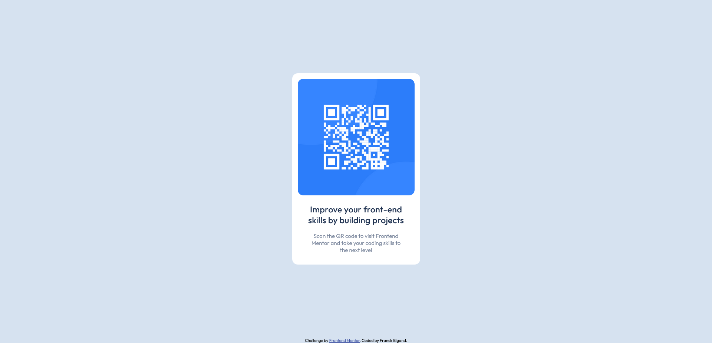

# Frontend Mentor - QR code component solution

This is a solution to the [QR code component challenge on Frontend Mentor](https://www.frontendmentor.io/challenges/qr-code-component-iux_sIO_H). Frontend Mentor challenges help you improve your coding skills by building realistic projects.

## Table of contents

- [Overview](#overview)
  - [Screenshot](#screenshot)
  - [Links](#links)
- [My process](#my-process)
  - [Built with](#built-with)
  - [What I learned](#what-i-learned)
- [Author](#author)

**Note: Delete this note and update the table of contents based on what sections you keep.**

## Overview

### Screenshot



### Links

- Solution URL: [https://github.com/FranckBigand/frontend-mentor/tree/main/qr-code-component-main](https://github.com/FranckBigand/frontend-mentor/tree/main/qr-code-component-main)
- Live Site URL: [https://franckbigand.github.io/frontend-mentor/qr-code-component-main/index.html](https://franckbigand.github.io/frontend-mentor/qr-code-component-main/index.html)

## My process

### Built with

- Semantic HTML5 markup
- Flexbox
- Custom properties

### What I learned

This is my first project on Frontend Mentor. The challenge was not very hard (marked as "Newbie" regardless). I was able to see how Frontend Mentor challenges works, download the base project, and publish it on GitHub Pages.

Below are the main styles of the design.

```css
.qr-code-card {
  width: min(100%, 21em);
}

.qr-code-image {
  width: 100%;
}
```

I could have gone with a fixed size (21em works at 375px width), however `min` unables the card to resize with lower width. `width: 100%;` lets the image to take the whole card width (except the padding).

To align the card horizontally, I used a very standard flexbox solution. However, to align it vertically, I made the card container take the whole height of the page.

```css
.body {
  height: 100vh;
}
```

This worked, however I wanted to add the attribution at the bottom of the page as a footer. So I used a flexbox solution with the two elements: the `main` containing the card, and the footer with the attribution. I used a `flex-grow: 1;` on main so it takes the available space, letting the footer at the bottom, but a scrolling appeared because of the default margin of body. So I cretaed a custom property to track body margin, and resized body height the 100vh minus twice this margin (one for top, one for bottom). This leads to this CSS:

```css
body {
  --body-margin: 1em;
  margin: var(--body-margin);
  height: calc(100vh - 2 * var(--body-margin));
}

body main {
  flex-grow: 1;
}
```

I didn't want to use a `position: absolute;` solution for footer, as I think it makes more sense to make it at the bottom of the page, instead of the bottom of the screen.

## Author

- Frontend Mentor - [@FranckBigand](https://www.frontendmentor.io/profile/FranckBigand)
